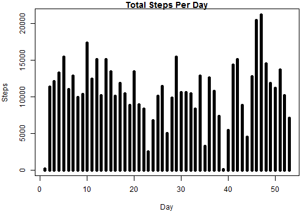
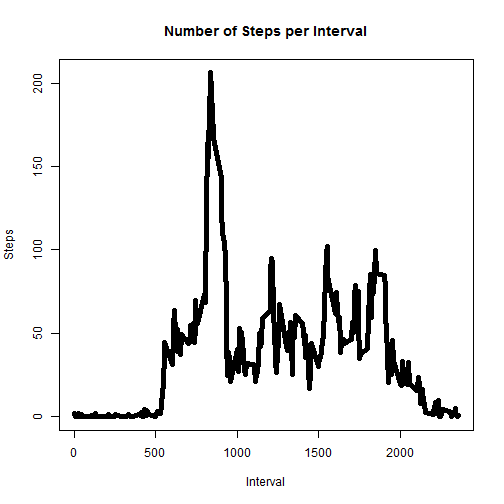
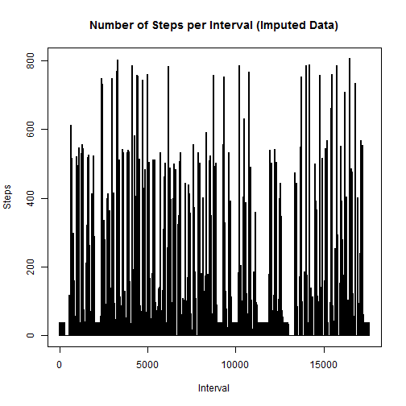
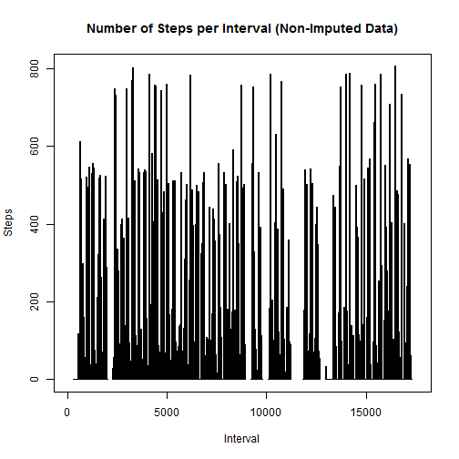
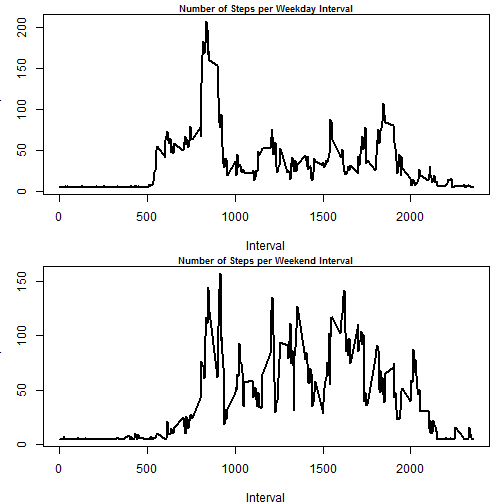

#Peer-graded Assignment: Course Project 1

##Abstract

This report explores data collected using activity 
monitoring devices such as a Fitbit, Nike Fuelband, or 
Jawbone Up.
The data consists of two months of data from an anonymous 
individual collected during the months of October and 
November, 2012 and include the number of steps taken in 5 
minute intervals each day.

##The Data

The data for this assignment can be downloaded from the 
course web site:
[https://d396qusza40orc.cloudfront.net/repdata%2Fdata%2Factivity.zip](Activity Monitoring Data)

The variables included in this dataset are:

-steps: Number of steps taking in a 5-minute interval 
(missing values are coded as NA)

-date: The date on which the measurement was taken in 
YYYY-MM-DD format

-interval: Identifier for the 5-minute interval in which 
measurement was taken


##Loading and preprocessing the data


```r
if(!file.exists("UCI HAR Dataset.zip")) {
        temp <- tempfile()
        download.file("http://d396qusza40orc.cloudfront.net/repdata%2Fdata%2Factivity.zip",temp)
        unzip(temp)
        unlink(temp)
}
data <- read.csv("activity.csv")
```


##What is the mean total number of steps taken per day?


```r
totstepsperday <- aggregate(steps ~ date, data, sum)
summary(totstepsperday)
```

```
##          date        steps      
##  2012-10-02: 1   Min.   :   41  
##  2012-10-03: 1   1st Qu.: 8841  
##  2012-10-04: 1   Median :10765  
##  2012-10-05: 1   Mean   :10766  
##  2012-10-06: 1   3rd Qu.:13294  
##  2012-10-07: 1   Max.   :21194  
##  (Other)   :47
```

```r
avsteps <- mean(totstepsperday$steps)
medsteps <- median(totstepsperday$steps)
```

The average total number of steps taken per day is 1.0766189 &times; 10<sup>4</sup>.

The median total number of steps taken per day is 10765.

###Here is a histogram illustrating the total number of steps taken per day:

```r
par(mar = c(5,4,1,1))
plot(totstepsperday$steps, type = "h", main = paste("Total Steps Per Day"), xlab = "Day", ylab = "Steps", lwd = 5)
```




##What is the average daily activity pattern?


```r
stepsperint <- aggregate(steps ~ interval, data, mean)

maxint <- stepsperint[which.max(stepsperint$steps),1]
```

###Here is a line plot illustrating the total steps per interval:


```r
plot(stepsperint$interval, stepsperint$steps, type = "l", xlab = "Interval", ylab = "Steps", main = "Number of Steps per Interval", lwd = 5)
```



The 5-minute interval that on average across all the days in the dataset 
contains the maximum number of steps is interval 835.


##Imputing missing values

###To impute the NA values in the data set I have elected to replace the NA values with the average number of steps per interval.


```r
summary(data)
```

```
##      steps                date          interval     
##  Min.   :  0.00   2012-10-01:  288   Min.   :   0.0  
##  1st Qu.:  0.00   2012-10-02:  288   1st Qu.: 588.8  
##  Median :  0.00   2012-10-03:  288   Median :1177.5  
##  Mean   : 37.38   2012-10-04:  288   Mean   :1177.5  
##  3rd Qu.: 12.00   2012-10-05:  288   3rd Qu.:1766.2  
##  Max.   :806.00   2012-10-06:  288   Max.   :2355.0  
##  NA's   :2304     (Other)   :15840
```

```r
avstepsint <- mean(stepsperint$steps)

nadata <- is.na(data$steps)

imputedata <- data.frame(steps = replace(data$steps, nadata, avstepsint), intervals = data$interval)

meansteps <- mean(data$steps, na.rm = TRUE)

impmeansteps <- mean(imputedata$steps)

mediansteps <- median(data$steps, na.rm = TRUE)

impmediansteps <- median(imputedata$steps)
```

The average total number of steps taken per interval in the original data set is 37.3825996.

The average total number of steps taken per interval in the imputed data set is 37.3825996.

The median total number of steps taken per day in the original data set is 0.

The median total number of steps taken per day in the imputed data set is 0.

As described in the above statements, the median and the
mean have remained unchanged in the imputed data set.

###Here are two histograms which illustrate the difference between the original data set and the imputed data set:


```r
plot(imputedata$steps, type = "h", xlab = "Interval", ylab = "Steps", main = "Number of Steps per Interval (Imputed Data)", lwd = 2)
```




```r
plot(data$steps, type = "h", xlab = "Interval", ylab = "Steps", main = "Number of Steps per Interval (Non-Imputed Data)", lwd = 2)
```



##Are there differences in activity patterns between weekdays and weekends?


```r
imputedata$date <- as.Date(data$date)
imputedata$day <- weekdays(imputedata$date)
imputedata$daytype <- as.factor(ifelse(imputedata$day == "Saturday" | imputedata$day == "Sunday", "weekend", "weekday"))

weekdaydata <- subset(imputedata, imputedata$daytype == "weekday")
wday <- aggregate(steps ~ intervals, weekdaydata, mean)
weekenddata <- subset(imputedata, imputedata$daytype == "weekend")
wend <- aggregate(steps ~ intervals, weekenddata, mean)
```

###Here we have a pair of plots illustrating the difference between weekend and weekday activity patterns:


```r
par(mfcol = c(2,1), cex.main = 0.75, mar = c(4,3,1,1))
plot(wday$interval, wday$steps, type = "l", xlab = "Interval", ylab = "Steps", main = "Number of Steps per Weekday Interval", lwd = 2)

plot(wend$interval, wend$steps, type = "l", xlab = "Interval", ylab = "Steps", main = "Number of Steps per Weekend Interval", lwd = 2)
```




##Conclusion
As illustrated in the above plots, weekend and weekday activity patterns are 
quite different, but with one obvious similarity. Both weekday and weekend
activity patterns spike in the interval range of 800-1000, but the weekday 
activity pattern is elevated in comparison to the weekend activity pattern in the interval range of 500-800, and the overall level of activity is much higher on the weekend. This most likely implies that our subject participates in rigorous physical activity every morning on weekdays and weekends, but on weekdays our subject wakes up earlier, and on weekends our subject performs more physical activity throughout the day.


